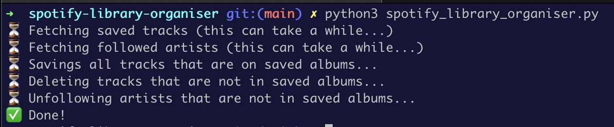

# Spotify Library Organiser

A script to organise my Spotify library based on my saved albums.

## Motivation

As I grew up with CDs, I'm very old-fashioned in the way I listen to music: one album at a time, listening to all the tracks...

Spotify is great but the different sections of the library are completely disconnected: when I discover a new album and save it to my library, the tracks are not automatically saved to my "Liked Songs", and the artist is not automatically followed.

## How it works

This Python script fetches all the albums currently saved in the user's library. For each album it will:

1. Make sure that all the album's tracks are saved in the "Liked Songs" playlist
2. Make sure that the album's creators are added to the "Followed Artists"

Finally, the script cleans up the "Liked Songs" and "Followed Artists" by removing any tracks/artists that are not in the currently saved albums.

## Requirements

- A Spotify account
- Python 3

## Usage

1. Create an OAuth app to authenticate with the Spotify API:
   a. Go to https://developer.spotify.com/dashboard
   b. Click "Create App"
   c. Fill in the form. For "Redirect URI", simply use "http://localhost/"
   d. Get your client id and client secret
2. Copy the `.env.example` file in this repository to create your `.env`. Fill in the values for `SPOTIPY_CLIENT_ID` and `SPOTIPY_CLIENT_SECRET` with the values you obtained in the previous step.
3. Start the script: `python3 spotify_library_organiser.py`. If you're running the script for the first time, it will open your browser so you can authorise its access to your Spotify account.

